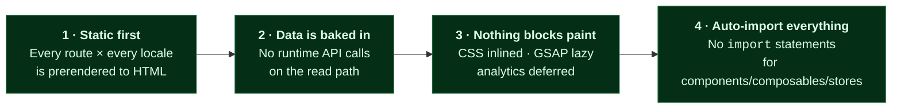
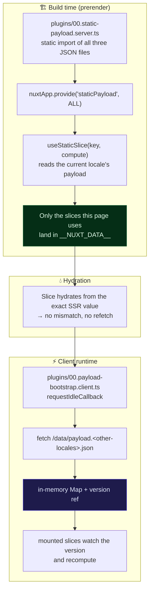
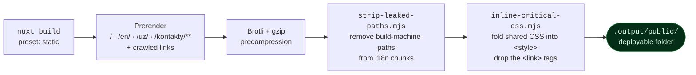

<div align="center">

# Frontend — Nuxt 3 (SSG)

**Fully prerendered, trilingual, zero render-blocking requests.**


</div>

> Part of the [Nuxt × Django full-stack template](../README.md). This document covers the frontend only — architecture, conventions, styling and every file you are expected to touch.

---

## Contents

1. [Run it](#1--run-it)
2. [Mental model](#2--mental-model)
3. [Directory guide](#3--directory-guide)
4. [Data layer — the static payload](#4--data-layer--the-static-payload)
5. [Routing & i18n](#5--routing--i18n)
6. [SEO](#6--seo)
7. [Styling system](#7--styling-system)
8. [Components](#8--components)
9. [Composables](#9--composables)
10. [Stores](#10--stores)
11. [Plugins & load order](#11--plugins--load-order)
12. [The build](#12--the-build)
13. [Conventions](#13--conventions)
14. [Known TODO](#14--known-todo)

---

## 1 · Run it

```bash
cp .env.example .env       # PowerShell: Copy-Item .env.example .env
npm install
npm run dev                # → http://localhost:3000
```

No backend required for development: the payload JSON files are committed to the repository.

| Script                            | Purpose                                                                                                |
| --------------------------------- | ------------------------------------------------------------------------------------------------------ |
| `npm run dev`                     | Dev server with HMR, bound to `--host` so you can open it from your phone                              |
| `npm run build`                   | **Production build** — `nuxt build` + `strip-leaked-paths` + `inline-critical-css` → `.output/public/` |
| `npm run generate`                | Plain `nuxt generate` without post-processing — prefer `build`                                         |
| `npm run preview`                 | Serve the built output                                                                                 |
| `npm run lint` · `lint:fix`       | ESLint, `--max-warnings=0`                                                                             |
| `npm run format` · `check-format` | Prettier                                                                                               |
| `npm run typecheck`               | `vue-tsc`, strict                                                                                      |

**Requires Node ≥ 20.11.**

---

## 2 · Mental model

Four ideas explain nearly every design decision in this codebase.



**Static first.** `nitro.preset: "static"`. The build output is a folder of files; there is no Node server in production. Anything you write in `server/` (like `server/api/health.get.ts`) exists for local development only.

**Data is baked in.** Content arrives as `server/data/payload.{ru,en,uz}.json`, produced by the backend's `export_payload` command. Pages read it through `useStaticSlice()`, never through `$fetch`. The one exception is the lead form, which POSTs to the live API.

**Nothing blocks paint.** Critical CSS is inlined and `<link rel="stylesheet">` tags are removed post-build; fonts are preloaded with `fetchpriority=high`; GSAP is imported lazily; analytics loads on first interaction or post-load idle.

**Auto-import everything.** Components, composables, stores and utils are registered by Nuxt. Writing an `import` for them is a code smell — it means the file is in the wrong directory.

---

## 3 · Directory guide

```
frontend/
├── app.vue                  Root — page transition, locale head, preconnect hints
├── app.config.ts            ⚙️ Brand + contact block (edit first)
├── nuxt.config.ts           ⚙️ Modules, i18n, SEO, nitro, image, prerender
├── error.vue                Global error boundary
├── nginx.conf               Production server config
│
├── app/
│   └── router.options.ts    Scroll behaviour (locale switch preserves position)
│
├── assets/styles/           SCSS design system  ─────────────────────┐
│   ├── style.scss             single entry, imported by nuxt.config  │
│   ├── main.scss              :root CSS custom properties per tier   │
│   ├── colors.scss            palette                                │
│   ├── base/                  reset · typography · fonts · z-index   │
│   ├── helpers/               breakpoints · mixins · functions        │
│   ├── variables/             transitions · state colors             │
│   ├── components/            page transition · scrollbar            │
│   └── animations/                                                   │
│                            ───────────────────────────────────────┘
├── components/              Auto-imported, no path prefix
│   ├── ui/                    Base* primitives + form controls
│   ├── layout/                Header · Footer · MobileMenu · Alerts · …
│   ├── feedback/              AppNotFound · AppRouteLoader
│   ├── sections/              Cross-domain sections (FaqSection)
│   └── svg/                   26 inline icons + nav/ (3 more)
│
├── composables/             Auto-imported (incl. subdirectories)
├── features/                📦 Domain modules — your product lives here
├── i18n/locales/{ru,en,uz}/ 11 namespaces per locale
├── layouts/default.vue      Header + <main id="main"> + Footer + overlays
├── middleware/              payload-bootstrap.global.ts
├── pages/                   / · /kontakty/ · [...slug].vue (404)
├── plugins/                 Numbered for explicit ordering
├── public/                  Static passthrough — fonts, favicon, data/, media/
├── scripts/                 Post-build optimizers (Node, no deps)
├── server/                  data/ (payload) + api/health.get.ts (dev only)
├── stores/                  Pinia
├── types/                   api · models · payload · env
└── utils/                   format · motion · parseCounter · seo
```

---

## 4 · Data layer — the static payload

### The contract

```ts
// types/payload.ts
export interface StaticPayload {
    site_config: SiteConfig; // singleton: contacts, socials, address, OG image
    faq: FaqPayloadItem[]; // translated, categorized, ordered
}
export type PayloadLocale = "ru" | "en" | "uz";
```

Extend this interface whenever you add a backend module — it is the single source of truth for the frontend↔backend content contract.

### Where the payload comes from, at each moment



### Using it

```ts
// composables/useFaq.ts — the whole file
import type { FaqPayloadItem } from "~/types/payload";

export const useFaq = () => ({
    items: useStaticSlice<FaqPayloadItem[]>("faq", (p) => p.faq),
});
```

```vue
<script setup lang="ts">
const { items } = useFaq(); // Ref<FaqPayloadItem[]>, SSR-safe, reactive
</script>
```

`useStaticSlice(key, compute)` gives you a `Ref` that:

- during prerender reads from the injected server payload for the route's locale,
- serializes **only this slice** into the page's hydration state under `app:slice:<locale>:<key>`,
- on the client recomputes automatically if the locale's payload arrives later (SPA navigation or language switch).

> [!IMPORTANT]
> **Never persist the payload to `sessionStorage`.** An earlier version did, and the persisted snapshot survived redeploys — shadowing freshly built content until the tab was closed. The in-memory cache is rebuilt from the current deploy on every hard reload, so it cannot go stale. The reasoning is documented in full at the top of [`composables/usePayload.ts`](composables/usePayload.ts).

### The bootstrap guard

`middleware/payload-bootstrap.global.ts` runs on client-side navigations only. Before rendering the target route it awaits the payload for that route's locale, with hard timeouts (300 ms for bootstrap, 600 ms for the locale fetch) so a slow or failed fetch can never hang navigation — the page simply renders with whatever is available.

---

## 5 · Routing & i18n

### URL scheme

| Locale              | Prefix | Home   | Contact         |
| ------------------- | ------ | ------ | --------------- |
| 🇷🇺 `ru` _(default)_ | none   | `/`    | `/kontakty/`    |
| 🇬🇧 `en`             | `/en`  | `/en/` | `/en/kontakty/` |
| 🇺🇿 `uz`             | `/uz`  | `/uz/` | `/uz/kontakty/` |

Strategy: `prefix_except_default`. Trailing slashes are enforced by `useSeo()` on canonicals and by `site.trailingSlash: true` in the sitemap, so the two never disagree.

### Namespaces

Eleven per locale — `common`, `nav`, `footer`, `seo`, `forms`, `home`, `contact`, `faq`, `alert`, `error-boundary`, `error404`.

With `lazy: true` each namespace becomes its own chunk per locale, and only the visitor's locale is downloaded. Switching language fetches the other locale's chunks on demand.

> [!WARNING]
> Adding a `.json` file is **not enough**. Every namespace must be listed explicitly under `i18n.locales[].files` in `nuxt.config.ts` — for all three locales. A file that isn't listed silently never loads.

### Scroll behaviour

[`app/router.options.ts`](app/router.options.ts) implements four rules, in order:

1. **Locale switch** (paths identical after stripping the prefix) → don't scroll at all.
2. **Back/forward** → restore the saved position.
3. **Hash link** → smooth-scroll to the element, offset 80 px.
4. **Everything else** → jump to top with `behavior: "instant"`, deliberately overriding the global `scroll-behavior: smooth`, so the scroll happens invisibly in the gap of the `out-in` page transition.

### Page transition

Defined in `app.vue` (not `nuxt.config.ts` — it needs real JS callbacks). An opacity-only cross-fade, `out-in` mode, 180 ms leave / 380 ms enter — _instant departure, gentle arrival_.

The `onBeforeLeave` hook freezes `<main>`'s height using a `ResizeObserver`-maintained ref. Without it, the brief moment when no page is mounted collapses the document, the browser clamps the scroll position, and the user sees an upward jump. The height comes from a ref rather than `offsetHeight` because reading layout in the leave hook forces a synchronous reflow on every navigation.

Only `opacity` animates ⇒ GPU-composited, **zero CLS**.

---

## 6 · SEO

### One call per page

```ts
useSeo({
    title: t("home.meta-title"),
    description: t("home.meta-description"),
    type: "website",
});

const jsonLd = useJsonLd();
jsonLd.organization();
jsonLd.website();
```

That produces: `<title>`, meta description and keywords, the full Open Graph set (with `1200×630` dimensions), Twitter card tags, `robots`, and a canonical link with an enforced trailing slash.

### Coverage

| Signal                       | Source                                                                                   |
| ---------------------------- | ---------------------------------------------------------------------------------------- |
| Canonical                    | `useSeo` — `${siteUrl}${path}/`                                                          |
| `hreflang` × 3 + `x-default` | `useLocaleHead` in `app.vue`                                                             |
| `og:image`                   | Page cover → `SiteConfig.hero_image` for the current locale → `/og-image.svg`            |
| `og:site_name`               | `useAppConfig().brand.name`                                                              |
| JSON-LD                      | `useJsonLd()` — organization, website, breadcrumbs, FAQ, service, article, creative work |
| `sitemap_index.xml`          | `@nuxtjs/sitemap`, `zeroRuntime: true` — no server needed                                |
| `robots.txt`                 | `@nuxtjs/robots`, points at `/sitemap_index.xml`                                         |
| `llms.txt`                   | `public/llms.txt`                                                                        |

> [!TIP]
> The OG image is resolved **per locale** — `/uz/` pages get the Uzbek image from Site settings, `/en/` the English one. Fill all three in the admin, or the RU one is used everywhere.

---

## 7 · Styling system

### Entry point

`nuxt.config.ts` imports exactly one file, `assets/styles/style.scss`, which pulls in the layers in order:

```
helpers → animations → base → components → main → colors → variables
```

Component styles live in `<style scoped lang="scss">` blocks. Global CSS custom properties live in `main.scss`.

### Responsive tiers

Five tiers, defined once in `helpers/_breakpoints.scss` and used by both SCSS and the DOM:

| Tier       | Range          |
| ---------- | -------------- |
| `mobile`   | ≤ 639 px       |
| `tablet`   | 640 – 1023 px  |
| `laptop`   | 1024 – 1279 px |
| `notebook` | 1280 – 1365 px |
| `desktop`  | ≥ 1366 px      |

```scss
@use "~/assets/styles/helpers/breakpoints" as bp;

.card {
    padding: 32px;
    @include bp.down("mobile") {
        padding: 16px;
    }
    @include bp.up("desktop") {
        padding: 48px;
    }
}
```

An inline `<script>` with `tagPriority: "critical"` in `<head>` stamps `data-tier="…"` onto `<html>` **before first paint**, so CSS can branch on device class with no flash and no JS-driven layout shift:

```scss
:root[data-tier="mobile"] .app-bottom-nav {
    display: flex;
}
:root[data-tier="desktop"] .app-header__burger {
    display: none;
}
```

### Fluid typography

`main.scss` redefines `--f-min`, `--f-max`, `--vw-min`, `--vw-max` per tier; the `rem()` / fluid functions in `helpers/_functions.scss` interpolate between them. Change the scale in one place and the whole site follows.

### Where to change the look

| File                          | Controls                                       |
| ----------------------------- | ---------------------------------------------- |
| `colors.scss`                 | Palette                                        |
| `base/_typography.scss`       | Type scale, headings                           |
| `base/_afonts.scss`           | Font family and `@font-face`                   |
| `helpers/_variables.scss`     | Spacing, radii, shadows                        |
| `variables/_transitions.scss` | Easing curves and durations                    |
| `main.scss`                   | Per-tier custom properties, header/nav heights |

---

## 8 · Components

Auto-imported with `pathPrefix: false` — the directory is organizational, the tag is just the filename.

| Directory   | Contents                                                                                                                                                                                                                                                      |
| ----------- | ------------------------------------------------------------------------------------------------------------------------------------------------------------------------------------------------------------------------------------------------------------- |
| `ui/`       | `BaseButton` `BaseHeading` `BaseLead` `BaseAccordion` `BaseCarousel` `BaseDropdown` `BookButton` `CheckList` `FactChip` `HeroMedia` `MediaGallery` `MediaPlaceholder` `OfferCard` `OptimizedMedia` `PageHero` `SectionHeader` `StatBand` `StepList` `SvgIcon` |
| `layout/`   | `AppHeader` `AppFooter` `AppContainer` `AppBreadcrumbs` `AppLangSwitcher` `AppMobileMenu` `AppMobileBottomNav` `AppAlerts`                                                                                                                                    |
| `feedback/` | `AppNotFound` `AppRouteLoader`                                                                                                                                                                                                                                |
| `sections/` | `FaqSection`                                                                                                                                                                                                                                                  |
| `svg/`      | 26 inline icons (`SvgArrowRight`, `SvgTelegram`, …) + the `SvgLogo` brand mark + 3 more in `svg/nav/`                                                                                                                                                         |

```vue
<template>
    <BaseButton :to="'/kontakty/'" variant="primary" rounded>
        {{ t("home.cta") }}
    </BaseButton>
</template>
<!-- No import statement. Ever. -->
```

Icons are Vue components rather than sprite references or ``: they inherit `currentColor`, are tree-shaken per route, and cost zero extra requests.

---

## 9 · Composables

| Composable           | Purpose                                                                   |
| -------------------- | ------------------------------------------------------------------------- |
| `usePayload`         | Payload plumbing: `useStaticSlice`, `ensureClientPayload`, locale helpers |
| `useSiteConfigData`  | Site settings slice, mirrored into the Pinia store                        |
| `useFaq`             | FAQ slice                                                                 |
| `useSeo`             | Meta, Open Graph, Twitter, canonical                                      |
| `useJsonLd`          | Structured data builders                                                  |
| `useLeadForm`        | Lead submission: state, alerts, error handling                            |
| `useBreakpoints`     | Reactive tier detection in JS                                             |
| `useScrollDirection` | Up/down detection (header hide-on-scroll)                                 |
| `useFocusTrap`       | Accessible modal/menu focus containment                                   |
| `useGsap`            | Lazy GSAP loader — never on the critical path                             |
| `useHeroIntro`       | Hero entrance animation                                                   |
| `useStatsCounter`    | Animated number counters                                                  |

Auto-imported from `composables/`, `composables/**`, and `features/*/composables`.

---

## 10 · Stores

| Store            | State                                                                                                                              |
| ---------------- | ---------------------------------------------------------------------------------------------------------------------------------- |
| `site-config`    | Contacts, socials, address — fed by `useSiteConfigData`, with a safe empty fallback so components never crash on a missing payload |
| `ui-alerts`      | Toast queue (`push(type, message)`)                                                                                                |
| `ui-mobile-menu` | Mobile menu open/closed                                                                                                            |

Stores hold state; they never fetch. Data enters through composables.

---

## 11 · Plugins & load order

Filenames are numbered because order matters.

| Order | Plugin                        | Side   | Role                                                          |
| ----- | ----------------------------- | ------ | ------------------------------------------------------------- |
| `00`  | `static-payload.server.ts`    | server | Imports the three payload JSONs and provides them to the app  |
| `00`  | `payload-bootstrap.client.ts` | client | Prefetches the _other_ locales at browser idle                |
| `05`  | `viewport-tier.client.ts`     | client | Keeps `data-tier` current on resize                           |
| —     | `scroll-reveal.ts`            | both   | Scroll-triggered reveal directive                             |
| `zz`  | `analytics.client.ts`         | client | Deferred GTM/GA4 loader (first interaction or post-load idle) |
| `zz`  | `payload-fix.ts`              | both   | Hydration edge-case guard                                     |

---

## 12 · The build



Both scripts re-emit the `.gz` and `.br` siblings after rewriting a file, so the precompressed assets nginx serves stay byte-consistent with the originals.

**Prerendered routes** come from `nitro.prerender.routes` (`/`, `/en/`, `/uz/`) plus `crawlLinks: true`, with `routeRules` marking `/`, `/en/**`, `/uz/**` and `/kontakty/**` as prerender targets. URLs containing `?` are ignored. Add new top-level routes to `nitro.prerender.routes` if nothing links to them.

**Cache headers** are declared twice on purpose — in `routeRules` (for hosts that read them) and in `nginx.conf` (for the VPS deployment). Keep them in sync if you change either.

> [!WARNING]
> `NUXT_PUBLIC_SITE_URL` and `NUXT_PUBLIC_API_BASE` are read at **build** time. Set the production values before `npm run build`, or `localhost` is permanently baked into canonicals, `og:url`, hreflang and the sitemap.

---

## 13 · Conventions

**Pages** call `useSeo()` / `useJsonLd()` and compose section components. No business logic, no data fetching, no styling beyond layout glue.

**Features** are self-contained domains under `features/<domain>/` with `components/`, `composables/`, `stores/`. Sections are referenced by tag only — see [`features/README.md`](features/README.md).

**Never `import`** a component, composable, store or util from the auto-import directories. If you feel the need, the file is in the wrong place.

**TypeScript is strict.** `types/` holds the shared contracts: `payload.ts` (backend contract), `models.ts` (domain entities), `api.ts` (request/response shapes), `env.d.ts`.

**Formatting** is Prettier over `vue,ts,js,scss,json,md`; linting is ESLint with `--max-warnings=0`. Run `npm run lint && npm run typecheck` before committing.

**Adding a locale** touches: `i18n.locales[]` in `nuxt.config.ts` · a new `i18n/locales/<code>/` directory with all 11 namespaces · `LOCALE_PREFIXES` in `app/router.options.ts` · `PayloadLocale` in `types/payload.ts` · `ALL_LOCALES` in `plugins/00.payload-bootstrap.client.ts` · `localeFromPath` in `composables/usePayload.ts` · `LOCALES` and `LANGUAGES`/`PARLER_LANGUAGES` on the backend · `nitro.prerender.routes` and `routeRules`.

---

## 14 · Known TODO

- [ ] **`public/og-image.png`** — de-branding removed the raster OG image; a neutral `og-image.svg` placeholder is in its place. Most social platforms do **not** render SVG previews. Add a real 1200×630 PNG and point `DEFAULT_OG_IMAGE` in [`composables/useSeo.ts`](composables/useSeo.ts) at it. (Filling `hero_image` in the CMS also solves this, per locale.)

---

<div align="center">

[← Back to the root README](../README.md) · [Backend README →](../backend/README.md)

</div>
