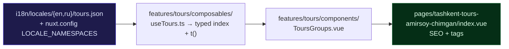

# `features/` — Domain-Driven Layer

Everything outside this directory is infrastructure — layout chrome, UI primitives, SEO, i18n, motion. `features/` holds the business domains of **City Center Apartments**: the apartments, the tours, the airport transfers, and the surfaces that sell them.

---

## Anatomy

```
features/
└── <domain>/
    ├── components/     Vue SFC sections for this domain
    ├── composables/    Domain composables (typed content, domain logic)
    └── stores/         Domain Pinia stores
```

Everything is auto-imported — the wiring already exists in `nuxt.config.ts`:

| Directory | Registered by | Config |
|---|---|---|
| `components/` | Nuxt components | `components: [{ path: "~/features", pattern: "**/components/*.vue", pathPrefix: false }]` |
| `composables/` | Nuxt imports | `imports.dirs: ["features/*/composables"]` |
| `stores/` | `@pinia/nuxt` | `imports.dirs: ["features/*/stores"]` |

> `pathPrefix: false` means the tag is the **filename**, not the path. `features/tours/components/ToursGroups.vue` → `<ToursGroups />`.

---

## Current domains

| Domain | What it owns |
|---|---|
| `home/` | The six sections of `/` |
| `apartments/` | `useApartments()` + the sections of `/tashkent-city-center-apartments/` |
| `tours/` | `useTours()` + the sections of `/tashkent-tours-amirsoy-chimgan/` |
| `transfer/` | `useTransferRoutes()` + the sections of `/tashkent-airport-transfer/` |
| `about/` | The sections of `/about-us/` |
| `contact/` | The sections of `/contact-us/` |
| `faq/` | `FaqSection` — one page-scoped subset per route |
| `booking/` | `useBookingLink()` and `BookingCtaBand` — the WhatsApp contract |
| `reviews/` | `useReviews()` + the marquee, gated by `REVIEWS_ARE_VERIFIED` |
| `social-proof/` | Client-only toaster: store, message pool, component |

---

## The three rules

### 1 · Pages compose, they never compute

```vue
<!-- pages/tashkent-tours-amirsoy-chimgan/index.vue -->
<template>
    <ToursHero />
    <ToursGroups />
    <ToursPractical />
    <FaqSection page="tours" />
    <BookingCtaBand context-kind="tour" />
</template>

<script setup lang="ts">
const { t } = useI18n();

useSeo({ title: t("seo.tours-title"), description: t("seo.tours-description") });
useJsonLd().breadcrumbList([...]);
</script>
```

That is the entire allowed content of a page: SEO calls plus section tags. No data fetching, no filtering, no conditionals over business state. If a page grows logic, that logic belongs in a feature composable.

### 2 · Reference by tag, never by import

```vue
<ToursGroups />              <!-- ✅ auto-imported -->
```
```ts
import ToursGroups from "~/features/tours/components/ToursGroups.vue";  // ❌
```

An `import` statement for anything in `features/`, `components/`, `composables/`, `stores/` or `utils/` means the file is in the wrong directory. Type-only imports from `~/types/` are the exception.

### 3 · Domains do not reach into each other

`features/tours/` must not import from `features/apartments/`. Shared code moves **up** — into `components/ui/`, `composables/`, or `utils/`. Two domains needing the same section is the signal that the section was never domain-specific. `social-proof/` calling `useApartments()` / `useTours()` goes through the auto-imported public composable, never through a file path.

---

## A domain, end to end

There is no backend and no payload pipeline. Content lives in the locale files; a composable turns a typed index of ids into locale-resolved objects.



**The composable** owns the ids and the shape; the locale files own the words:

```ts
const TOUR_INDEX: ReadonlyArray<{ id: string; category: TourCategory }> = [
    { id: "amirsoy-day-trip", category: "mountains" },
];

export const useTours = () => {
    const { t } = useI18n();
    const items = computed<Tour[]>(() =>
        TOUR_INDEX.map((entry) => ({
            id: entry.id,
            category: entry.category,
            title: t(`tours.items.${entry.id}.title`),
        })),
    );
    return { items };
};
```

Data flows one way: **locale file → composable → component**. Components never fetch; stores never fetch.

---

## Checklist for a new domain

- [ ] `features/<domain>/` created with only the subdirectories you actually need
- [ ] Composable holds a typed id index and resolves copy through `t()` — no `$fetch` on the read path
- [ ] Sections are referenced by tag only
- [ ] Page contains SEO calls and tags, nothing else
- [ ] i18n namespace created for **both** locales (`en`, `ru`), wrapped in a top-level key matching the filename, and registered in `nuxt.config.ts` → `LOCALE_NAMESPACES`
- [ ] Route added to `nitro.prerender.routes` if nothing links to it
- [ ] Every section wraps its content in `<AppContainer size="wide">`
- [ ] No cross-domain imports

---

[Root README](../README.md)
